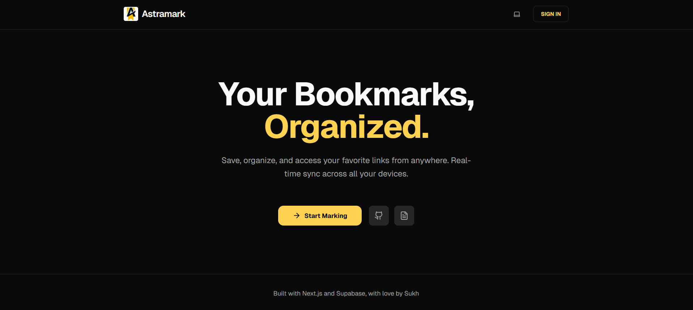
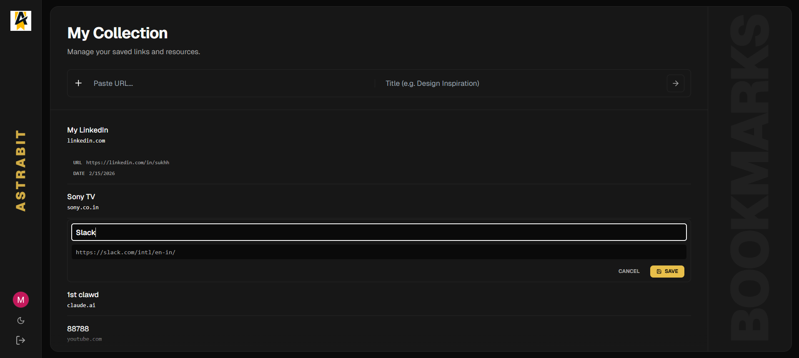

# Astramark — Realtime Bookmark Manager (Challenge Submission)





Live: [https://astramark.vercel.app](https://astramark.vercel.app/)


This project started as something I initially thought would be straightforward.

However, the real challenge was not the feature itself, but adapting to a different stack — Next.js App Router, Supabase, Realtime, and RLS — which was very different from my usual React + Node + SPA workflow.

This README focuses less on “what I built” and more on **what the project actually made me learn and go through**.

---

# 🧠 Initial Understanding & Knowledge Gaps

Before starting, I identified several gaps:

- Limited hands-on experience with Next.js App Router (vs traditional SPA)
- Confusion around Supabase structure and RLS
- Uncertainty about realtime (Webhooks vs WebSockets)
- Client vs Server responsibility in App Router
- Whether global state libraries were needed or not

Coming from SPA architecture, the biggest mental shift was:

> Fetching data on the server first, then enhancing it on the client.
> 

Understanding that Supabase acts as:

- Database (Postgres)
- Auth provider
- Realtime pub-sub layer
- Backend service (without writing a custom API)

was a key architectural realization early on.

---

# 🏗️ How I Approached the Architecture

I structured the system intentionally to keep it simple and predictable:

- **Server owns:** auth checks, session validation, initial data fetch, secure mutations
- **Client owns:** UI interactivity and realtime subscriptions
- **Database (Supabase):** single source of truth with RLS enforcement

Data flow:

```
Server fetch (SSR snapshot) → Client realtime subscription → UI sync
```

I avoided overengineering (no Zustand/Redux) and kept state minimal, relying on realtime instead.

---

# 🔐 OAuth & Protected Routing Challenges

The first major implementation was Google OAuth.

Issues faced:

- Redirect logic errors
- Callback URL mismatches
- Session persistence confusion
- Production redirect breaking (localhost vs deployed domain)

Key learning:

OAuth is not just about login — it requires correct coordination between:

- Google Console
- Supabase Redirect URLs
- Environment variables
- App routing

Fix:

Dynamic redirect handling instead of hardcoded localhost URLs.

---

# 🗄️ Database, RLS & Schema Design

I created migrations for schema tracking and implemented:

- Bookmarks table
- Row Level Security (RLS)
- Realtime enablement

Understanding RLS was a big shift.

Instead of filtering data manually on the client, I learned that:

> Security should be enforced at the database level, not the UI level.
> 

This made the architecture cleaner and safer.

---

# ⚡ Realtime — The Hardest Technical Part

Initially, realtime showed “SUBSCRIBED” but UI did not update.

This took significant debugging and I found 3 real root causes:

### 1. Session Not Ready During Subscription

Realtime was initializing before client session hydration.

WebSocket connected as `anon`, and RLS silently blocked events.

Fix:

Wait for authenticated session before subscribing.

---

### 2. Incorrect Filtering Blocking DELETE Events

I used column-based filters in realtime.

This accidentally blocked valid DELETE payloads.

Fix:

Removed aggressive filters and relied on RLS instead.

Key insight:

> Database-level RLS is safer than client-side filtering in realtime systems.
> 

---

### 3. Server Revalidation vs Realtime State

Frequent server revalidation caused UI inconsistencies and masked realtime updates.

Fix:

- Reduced unnecessary revalidation
- Let realtime handle UI synchronization
- Treated DB as single source of truth

---

# Major Mistake: Overengineering with Collections

At one point, I tried to introduce a collections/folders feature.

What I did:

- New schema
- FK relationships
- Extra CRUD logic
- New realtime strategy

What happened:

- Request times jumped to 5–6 seconds
- Realtime completely broke
- Architecture became unstable overnight

I spent hours trying to fix it before realizing:

> The feature complexity exceeded the MVP scope.
> 

Final decision:

- Created a separate `collections-experiment` branch (to preserve work and go back to it later)
- Reset main branch to last stable state
- Reverted schema changes in database
- Restored simple realtime architecture

This was a difficult but important engineering decision.

Key lesson:

> Simplicity is more valuable than premature feature expansion.
> 

---

# Performance & Stabilization Phase

After rollback, I focused on:

- Cleaning architecture
- Centralizing configs (no hardcoded URLs)
- Parallel data fetching where possible
- Dedicated realtime hook for separation of concerns

Current latency:

- ~500–1500ms mutation time (Supabase roundtrip)
- ~400–600ms dashboard load (acceptable for SSR + DB architecture)

This was higher than my usual SPA experience, but helped me understand:

Client-server component boundaries and network geography impact performance significantly.

---

# 🤖 Use of AI Tools (Transparent)

Yes, I used multiple AI tools during the development process, but primarily as thinking partners rather than code generators.

- **Claude** — Used mainly for architectural discussions. I would explain my design decisions (realtime flow, SSR + client sync, RLS usage) and use it to identify edge cases, flaws, or missing considerations in my reasoning.
- **Gemini** — Used for UI refinement and debugging realtime issues by cross-referencing Supabase documentation and understanding implementation nuances.
- **ChatGPT (GPT)** — Used for documentation drafting, reasoning support, and some boilerplate structuring where it performed best in clarity and organization.
- **Antigravity** — It destroys the codebase, highly not recommended XD

All core architecture decisions, debugging, and final implementations were manually reasoned, tested, and validated by me.

AI was used as a learning and review tool to challenge my assumptions, not as a replacement for development or problem-solving.

---

# 🎯 Hardest Part of the Challenge

The hardest part was REALTIMEE-

> Aligning Realtime + RLS + Auth + SSR hydration timing in a Next.js App Router environment.
> 

Silent failures (no errors, no payloads) in realtime due to session timing and RLS were particularly challenging and required deep debugging and documentation reading.

---

# 🌍 Deployment Notes

Deployed on Vercel with:

- Supabase production project
- Correct OAuth domain configuration
- Dynamic redirect handling
- External Google account testing (not owner-only)

The project is fully accessible and testable via the live link.

---

# 🪞 Final Reflection

This project looked simple at first, but it became a strong learning experience in:

- Server-first architecture (Next.js App Router)
- Supabase as a full backend system
- Realtime system design
- RLS-based security thinking
- Knowing when to rollback instead of forcing a broken feature

More than the final product, the real value was the architectural learning and debugging journey.